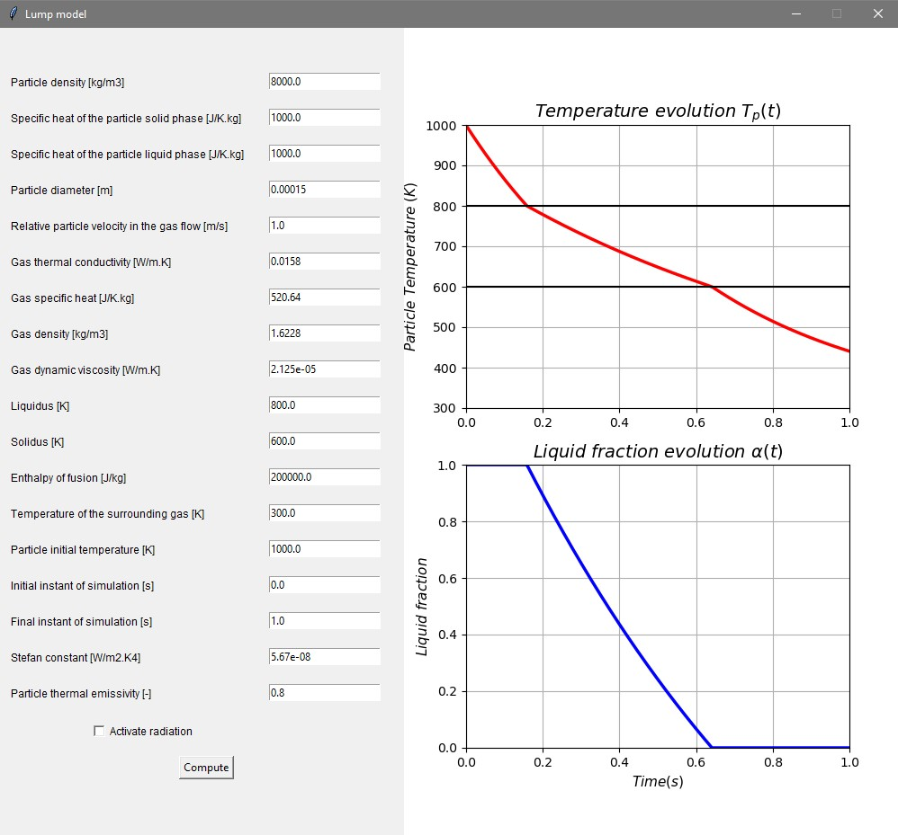

# Lump Model Simulation

The "Lump Model Simulation" is a Python script that utilizes the `Tkinter` library for creating a graphical user interface (GUI) and the `matplotlib` library for visualizing and simulating a lumped-parameter model. This script allows users to interact with various parameters and visualize the temperature evolution and liquid fraction of a particle over time.

## Overview

The script enables users to explore the behavior of a particle undergoing heating and cooling processes. The simulation considers heat conduction and radiation effects. Users can modify the input parameters to observe how changes affect the temperature and liquid fraction of the particle.

## Prerequisites

Before running the script, ensure you have the following libraries installed:

- `Tkinter`
- `matplotlib`
- `numpy`
- `scipy`

## Usage

1. Run the script in your preferred Python environment.
2. A GUI window will appear, providing fields for various parameters related to the simulation.
3. Input the desired values for the parameters:
   - `rho_p`: Particle density [kg/m3]
   - `c_ps`: Specific heat of the particle solid phase [J/K.kg]
   - `c_pl`: Specific heat of the particle liquid phase [J/K.kg]
   - `d`: Particle diameter [m]
   - `U0`: Relative particle velocity in the gas flow [m/s]
   - ... and more.
4. Check the "Activate radiation" checkbox to include radiation effects in the simulation.
5. Click the "Compute" button to perform the simulation.
6. The GUI will display two plots:
   - Temperature evolution of the particle over time
   - Liquid fraction evolution over time
7. You can observe the particle's temperature and liquid fraction changes based on the input parameters.

## Functionality

The script offers the following key functionality:

- Calculation of the Nusselt number correlation for convective heat transfer.
- Conversion between temperature and enthalpy based on input parameters.
- Differential equation solving for temperature and liquid fraction evolution.
- Visualization of the simulation results using interactive plots.

## License

This script is provided under the [MIT License](LICENSE), allowing you to use, modify, and distribute the code.

